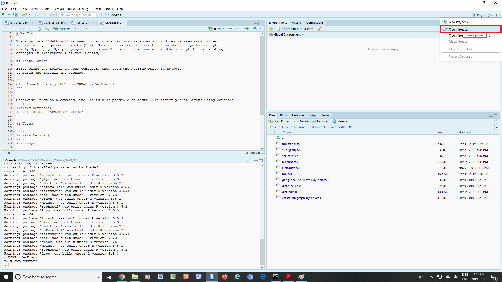

# NetFrac

The R package **NetFrac** is used to calculate various distances and indices between species communities in sequence similarity sequence (SSN). Some of these measures are based on the shortest path concept, namely Spp, Spep, Spelp and Spinp distances and the Transfer index, and a few others are adapted from existing concepts in the literature (UniFrac, Motifs). The networks are Igraph objects consisting of nodes and edges.

## Installation

From a command line prompt or terminal, clone the folder on your computer using the following command:

```
git clone https://github.com/XPHenry/Netfrac.git
```

Then in RStudio, select the project with the project icon at the top right, and the NetFrac environment is ready.



Otherwise, from an R command line or interface, you can also install it directly from GitHub using devtools:
```r
library(devtools)
install_github("XPHenry/Netfrac")
```

## Usage

```r
library(NetFrac)
?NetFrac
```

You can refer to the manual in the GitHub (https://github.com/XPHenry/Netfrac/blob/master/NetFrac.pdf) for detailed informations about the functions included in  our package.

For more information also see the following article:
Henry Xing, Steven W Kembel, Vladimir Makarenkov, Transfer index, NetUniFrac and some useful shortest path-based distances for community analysis in sequence similarity networks, Bioinformatics, ,btaa043, https://doi.org/10.1093/bioinformatics/btaa043

## License

This package is free and open source software, licensed under GPL.